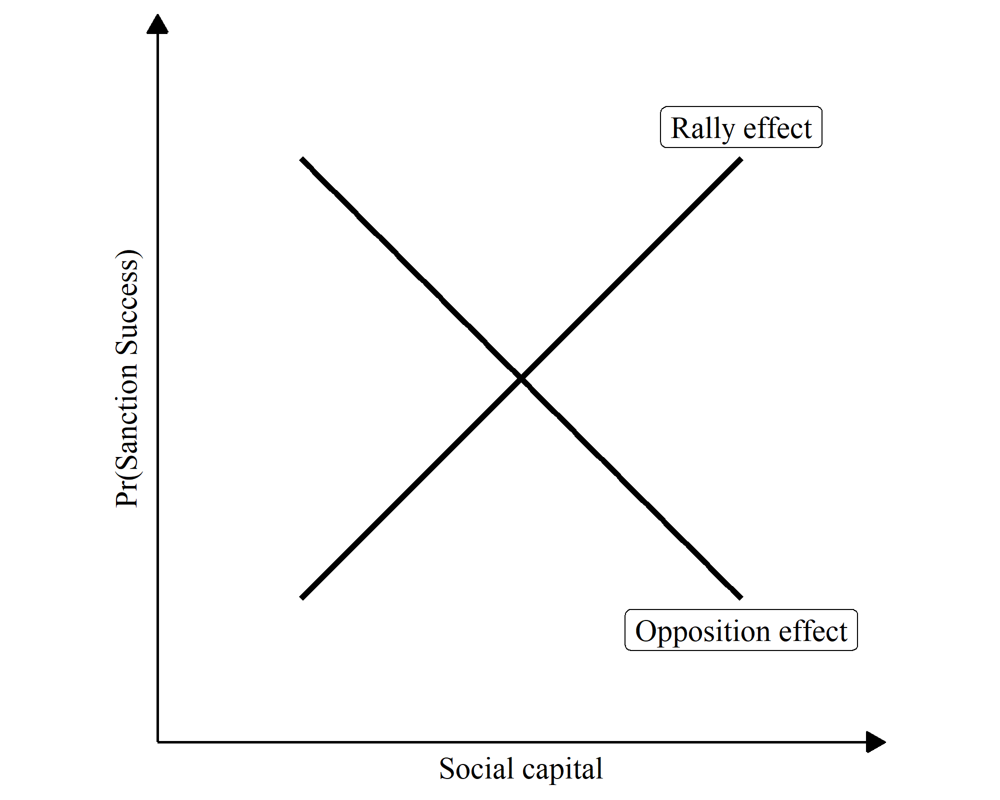
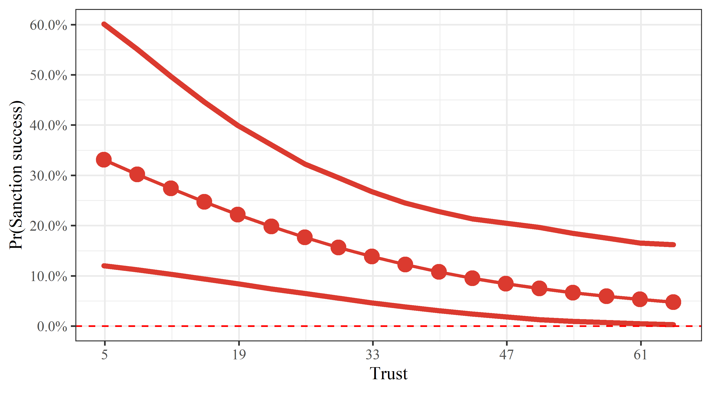
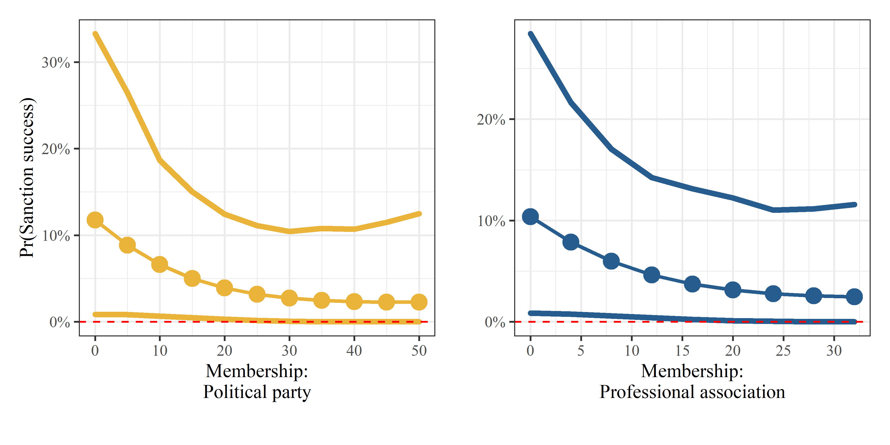
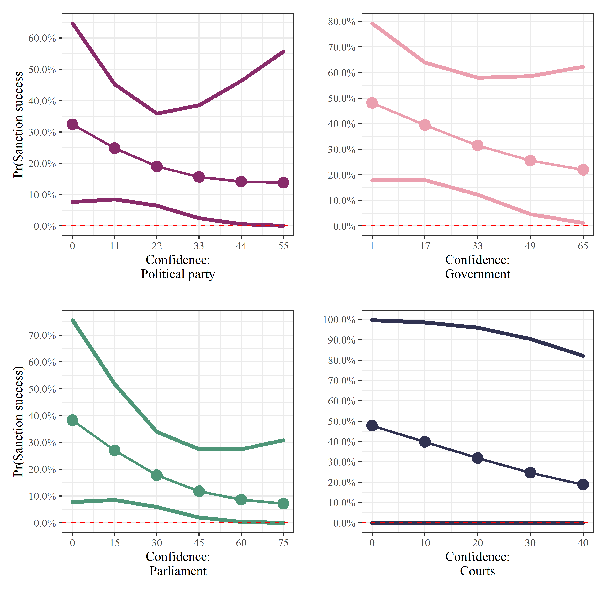

```{r setup, include = FALSE}
pacman::p_load(ezpickr, broom, psych, sandwich, 
               lmtest, modelsummary, tidyverse)
knitr::opts_chunk$set(
  comment = '', fig.width = 6, fig.height = 6
)
```

# Introduction

When North Korea conducted its first underground nuclear test in 2006, the United Nations (U.N.) adopted resolution 1718, acting unanimously under Chapter VII of the UN Charter. With six nuclear tests between October 2006 and September 2017, the economic sanctions have been strengthened every time. The initial sanctions targeted Kim Jong-il and his supporters for the nuclear weapons program by restricting their ability to travel, prohibiting the flow of luxurious goods, and freezing their financial accounts abroad.[^1]

These targeted sanctions have not curbed Pyongyang’s nuclear ambitions. Policymakers in South Korea have been discussing ways to increase the effectiveness of these sanctions since North Korea’s nuclear tests on 6 January 2016 and 9 September 2016. The South Korean Ministry of Unification announced one such effort—closing the Kaesong industrial complex—in February 2016. This action was part of a general strategy to increase the number of North Koreans afflicted by sanctions in the hope of inciting the populace to force Kim Jong-un to amend his policies.[^2]

When a sender imposes a sanction, it can be expected that it will damage the targeted states’ economies and increase the political and economic costs of a leader in the targeted states. Therefore, for an economic sanction to be successful, it is essential that a sanction is costly for the leader. However, sanctions sometimes are not costly. For instance, when North Korea confronted economic sanctions, its leader declared that he regards sanctions as an act of war [@frank2006a]. Then, citizens are most likely or mobilized to support the leadership in the face of foreign coercion  [@cortright2002a].

Therefore, this leads to the question, whether and under what circumstances economic sanctions succeed? Firstly, it is plausible that shifting the burden of sanctions might rouse the general populace to confront its government and force a policy change, particularly if the sanctions were imposed for reasons seemingly unrelated to ordinary citizens. In other words, a populace can be mobilized from the bottom up if people believe they are being afflicted by a kind of tariff imposed only because its leaders behave in a certain way. Plausibility notwithstanding, however, we argue that one important construct can prevent this strategy from succeeding: social capital.

Social capital embodies collective values such as trust, membership, and confidence in institutions that unite people. When assessing sanctions, social capital matters as the success of the sanctions may depend on the likelihood of mobilizing an afflicted populace from the bottom. When the nature of a nation’s social capital is such that it can unite a populace to demand policy changes from its leader, we posit that an *opposition effect* favors the success of the sanctions. When the nature of social capital is such that it unites the populace behind a leader who defies the sanctions, we posit that a *rally effect* assures that more comprehensive sanctions will fail.

Drawing from two datasets spanning 1981 to 2005—the Threat and Imposition of Sanctions (TIES) and the World Values Survey (WVS)—we investigate whether the *opposition effect* or the *rally effect* of social capital dominates a populace’s response to sanctions. We empirically demonstrate which of the two contradictory effects can be observed using the data. If social capitals have opposite effects on economic sanctions, a populace is likely to mobilize effectively against their leader to let him comply with the sanctions. Otherwise, a sanctioned country’s populace shares high degrees of interpersonal trust, membership in social or political organizations, confidence in key institutions, and they support the leader to fight against economic sanctions.

This paper proceeds as follows. The second section studies literature related to social capital, and the third explains the theoretical effects of social capital in response to sanctions. The fourth section describes the data collection, variables, and methods. The fifth presents the empirical findings, and the sixth section concludes.

# Literature Reviews

## Social captial

@putnam1993a and @putnam2000a introduced the concept of social capital as ‘features of social organizations such as networks, norms, and social trust that facilitate coordination and cooperation for mutual benefit’ [@putnam2000a: 65]. Social capital remains much-discussed in political science and is particularly used to explain phenomena such as political participation. The origins of social capital appear in the works of @bourdieu1986a and @coleman1988a, and the concept continues to be defined generally as degrees of trust, networks built through association (membership), and the confidence people feel within their communities.

@bourdieu1986a perceived social capital as the institutionalization of relationships and mutual acquaintance and the sum of the benefits or opportunities that an individual or an institution will achieve, both real or virtual, through a network. @coleman1988a defined social capital as an aspect of social relations or social structure in which certain actions become possible for an individual through participation. In addition, @brehm1997a viewed social capital as a similar concept to a cooperative network (social network) within the community where individuals’ engagement in communities created higher levels of interpersonal trust and thus, promoted collective action between citizens to facilitate the resolution of problems within that community.

High degrees of social capital enhance societies and their effective functioning. Three of its aspects are particularly influential and can be measured. The first is trust, which heightens a sense of inclusion. As trust increases, members are more likely to support and protect the community. The second is membership, which allows for smaller groups of like-minded people to create dense networks that engender information flow. Finally, confidence is about high levels of social capital developed within communities. When the populace has confidence in their communities, they tend to show greater political efficacy.

Empirical studies generally employ social capital as a dependent variable. However, prominent scholars use it as an explanatory variable to explain democratic or economic performance [@putnam1993a, @fukuyama1995a]. The *critical citizen theory* and *dissatisfied democrat theory*, for example, contend that political participation increases when people are dissatisfied within their communities [@dalton2015a]. @a1963a, *The Civic Culture*, clarifies how feelings of efficacy inspire confidence among the populace and encourage people to contribute to their societies. Through feelings of efficacy, political participation increases as trust and confidence increase within a community.

Research into social capital mainly addresses comparative politics, and extensive survey research compares and contrasts degrees of social capital in countries and regions. By observing social capital within the framework of international relations and particularly the international political economy, we observe how social capital contributes to resisting sanctions. In measuring social capital, according to degrees of intra-community trust, membership, and confidence, we theorize whether higher degrees of social capital encourage a populace to defy sanctions and resist policy concessions.

## Economic Sanctions

Traditionally, scholars considered economic sanctions as a substitute for military intervention, defining the concept as the tools of economic statecrafts to achieve only political goals, not economic goals [@pape1997a]. However, it is challenging to distinguish economic sanctions between political goals and other types of goals. Thus, another line of studies attempts to expand its concept, suggesting that economic sanction should be more than just economic coercion for political goals. For example, @baldwin1985a states that economic sanctions are statecrafts that reveal a strong willingness to audiences in third countries and pursue changes more than target states’ attitudes.

As the concept of economic sanctions extends beyond various types of goals, it implies ‘deliberate, government-inspired withdrawal, or threat of withdrawal, of customary trade or financial relations’ to ‘achieve foreign policy goals’ [@hufbauer2007a], or the limitations or disconnections of economic relations, which are aimed at changing the relevant policies of the countries in dispute [@morgan2009a]. In sum, economic sanctions scholarships have a consensus on an instrumental definition that economic sanctions should include economic mechanisms, but the outcomes are not restricted to the economic area.

Conventional wisdom insists that sanctions do not provoke meaningful compliance from the sanctioned country. As @hufbauer2007a note, sanctions ‘may simply be inadequate for the task. The goals may be too elusive; the means too gentle; or cooperation from other countries, when they needed, too tepid’. In a little over 25% of the cases they examined, sanctions exerted costs estimated to exceed 2% of sanction nations’ GNP. Altogether, sanctions do not seem always to impose severe economic consequences.

Given the general ineffectiveness of sanctions, scholars pose two questions: ‘Why do policymakers still impose them?’ and ‘What conditions, if any, might be conducive to successful sanctions?’ We seek to answer the latter question by observing degrees of social capital in sanctioned countries. We posit that social capitals--trust, membership, and confidence in institutions--are significant in determining whether a populace supports or resists its leader’s response to sanctions.

# Theory
## Economic sanctions and social capitals

Let us assume that country A, i.e., sender, and country B, i.e., target, are in a trade dispute and country A decides to impose sanctions that inflict sufficient economic hardships on country B to cause it to alter its policy. Country B suffers direct hardships via economic losses (reduced trade, investment, or GDP) and indirect hardships via burdens on its populace. Such burdens might include less government spending on public health [@marks1999a], reduced disaster prevention and mitigation [@mclean2019a], and fewer anti-terrorism initiatives [@navin2016a]. Country B’s leader can defy A’s sanctions and uphold existing policies or make partial or comprehensive concessions to A’s demands.

Although earlier literature treats countries A and B as unitary actors [@lacy2004a], this study departs from these dyadic assumptions by modeling whether social capital influences the extent to which the leader of the country B can defy the sanctions. In this study we posit that social capital influences how the populace might react, which affects the leader of country B’s decision via two mechanisms that let the populace mobilize against their leader, or rally around their leader against the sanction; and this study in we use the customary approach. Numerous studies analyze the role of within-state actors or domestic institutions in determining sanctions or threats. However, most studies focus on domestic political institutions within the sanction-imposing country [@cox2006a], among interest groups [@kaempfer1992a], and with voters [@mcgillivray2004a] and few studies examine the internal and social characteristics of the sanctioned countries. Several studies document how rally-round-the-flag effects lead to failed sanctions in the targeted states [@allen2005a; @allen2008a], however, few systematize the conditions under which these effects work successfully. We find that the degree of social capital in the sanctioned country illuminates the issue, although it can lead to potentially contradictory results.

Assuming sanctions are in place, we argue that social capital measured by the dimensions of trust, membership, and confidence in political institutions affects how the leaders of sanctioned countries react to sanctions. In this study we develop how social capital can generate *opposition effects* and *rally effects* among the populace of sanctioned countries and demonstrate that they potentially influence whether sanctions succeed.

## Opposition effect

Traditional explanations of economic sanctions focus on punishment, stating that the more painful the sanctions, the greater is the possibility of the target state facing political disintegration. It implies that when sanctions negatively affect the standard of living in a target state, these social hardships provide the ruled populace in the targeted states the incentives to mobilize and pressurize the government to comply with the senders’ demands [@lektzian2007a: 850]. It is challenging that sanctions are always ‘smart’, which means that even targeted sanctions on specific groups within the targeted states can affect all domestic actors in the target. For example, on 7 August 2018, the Trump administration in the US completely restored UN sanctions against Iran. The sanctions against Iran date back to the time of the Iranian Revolution in 1979. The US argues that the sanctions against Iran target the Iranian government, not Iranian citizens.
Nevertheless, the US economic sanctions severely harm the everyday lives of Iranian citizens. The sanctions restricted the Iranian citizens’ access to daily necessities due to rising prices. Medicine was one of the typical necessities that Iranian citizens faced challenges to procure. Although the US sanctions do not directly restrict the medicine supply chain, medicine companies refuse to sell their product in Iran, taking into account their relationship with the United States. Consequently, patients who have cancer, epilepsy, and hemophilia have difficulties in treatment. Even if Iran tries to produce substitutes domestically, it is difficult to obtain essential ingredients due to sanctions [@bbc2014].

From the perspective of the targeted state’s society, sanctions are a tariff, even if they are imposed for reasons unrelated to trade, such as in response to the development of weapons of mass destruction and it is reasonable to expect the targeted society will hold its leader accountable for policies that generate these sanctions.

In this study we maintain that social capital supplements the gaps in the theoretical arguments concerning winning coalitions, encouraging people to collaborate and mobilize to demand policy concessions from their leader. Facing the mobilization, the leader should feel the pressure when he keeps fighting against economic sanctions. In other words, such mobilization provides an opposition effect, which makes the leader more likely to reverse his policies and comply with sanctions. Sanctions are more likely to be successful when social capital is higher as the increased social capital enables more effective collective action. This study develops the following hypothesis from this argument: 
\newline
\begin{hyp}\label{opposition} {\bf Opposition Effect}: As the level of social capital increases, the likelihood of sanction success increases.\end{hyp}

## Rally effect

In this opposing scenario, strong internal ties in the sanctioned country prompt the populace to rally around its leaders. As with the *opposition effect*, the public bears most of the onus of sanctions and does not criticize the government’s policy because social capital creates conditions that support the leader’s decision to defy sanctions. For many cases of sanctions, it is also possible that social capital creates an environment in which the leader can employ social capital for personal political purposes. The leader dominates resources, controls information, and blames outside intervention by framing the sanctioned country as a victim of international conflicts.[^3] The populace consequently views sanctions as foreign interference and finds no need to revolt against them. The leader thus has an incentive to use high social capital as a tool to create a *rally effect* through which people are inspired to support resistance to sanctions and the sanctioned government continues its controversial policy. High degrees of social capital in a sanctioned country can be a double-edged sword in this regard.

In sum, there are two reinforcing effects that lead to the condition that is favorable to the leader of the sanctioned country. While social capital can spontaneously generate support to an extent, the leader can also manipulate the sources of information that create support. Thus, there are two kinds of *rally effects*--one spontaneous and another contrived. In reality, it is not easy to differentiate between the actions that create social capital, appeal to social capital, and suppress the *opposition effect*. However, in this study we note that they work in the same direction that hinders the success of sanctions.

For example, the leader of the sanctioned country can use community organizations to monitor and suppress oppositions. They can use social networks to encourage collective action that criticizes sanctions. Propaganda can be dispersed throughout the community to demonize the ‘imperialist force’ imposing sanctions and attacking national sovereignty. If successful, the populace unites against the sender country, supporting its leader in continuing to resist. This *rally effect* leads to the opposite expectation from the *opposition effect* as high degrees of social capital are conducive to sanction opposition. In this case, the degree of social capital should be associated positively with the leader of the sanctioned country’s ability to manipulate the situation. If the *rally effect* dominates, the leader of the sanctioned country is expected to use social capital to defy sanctions. \newline

\begin{hyp}\label{rally} {\bf Rally Effect}: As the level of social capital increases, the likelihood of sanction success decreases.\end{hyp}

```{r, echo = F, out.width="65%", fig.align='center', fig.cap = "\\label{fig1} Offsetting effects of social capital on the likelihood sanctions are successful."}

```

Figure \ref{fig1} summarizes the theoretical expectations based on the conflicting *opposition effect* and *rally effect* of social capital. The success of sanctions depends on the degree of social capital in the sanctioned country. Social capital helps reveal citizen preferences effectively through collective action, which can function negatively as a veto constraint (*opposition effect*) or positively as defenders of the sanctioned country’s leader (*rally effect*). The question now shifts to determining which effect is greater. As the degree of social capital increases, will the afflicted populace mobilize, oppose the leader’s policy, and display the *opposition effect*? Or will the populace support its leader in defying sanctions through the *rally effect*? It is unclear which effect prevails as social capital increases. In this study, we posit that both effects are theoretically plausible, and that empirical evidence will reveal which outweighs the other.

# Data, Variables, and Methods

## Data

In this study, we subject the theory of social capital, information, and sanctions to empirical tests using three datasets. One is the Threat and Imposition of Sanctions (TIES) project (Version 4.0), which covers imposition of sanctions from 1945 to 2005 [@morgan2009a], and the other is the dataset from the World Values Survey (WVS). Combining these datasets, the individual instances of sanctions across 1981–2005 are analyzed. WVS has conducted one of the largest cross-national opinion surveys since 1981 regularly, and we utilize the data from the survey to operationalize social capital by measuring survey questions related to trust, membership, and confidence. We include Countries in all six waves of the WVS. Wave 1 covers 1981–1984, Wave 2 covers 1990–1994, Wave 3 covers 1995–1998, Wave 4 covers 1999–2004, Wave 5 covers 2005–2009, and Wave 6 covers 2010–2014. Although Wave 1 posed survey questions about trust, membership, and confidence to only nine countries, the number rose to 17 in Wave 2, 53 in Wave 3, 40 in Wave 4, 57 in Wave 5, and 59 in Wave 6.[^4]

## Variables

Our dependent variable identifies the success of sanctions as a binary variable using the variable, *Final Outcome*, from the TIES data. Sanctions have been defined as successful and are assigned a value of 1 if the termination of the sanctions leads to ‘Partial Acquiescence by the Target State’, ‘Total Acquiescence by Target State’, and ‘Negotiated Settlement’. The other outcomes such as ‘Capitulation by the sender’, and ‘Stalemate’, are coded as failed outcomes and are assigned a value of 0.[^5]

Our main explanatory variables in this study, are the average of each country’s degree of social capital, which is operationalized through one question concerning trust, two concerning membership, and four concerning confidence from all six waves of WVS. Using the online analysis, we merge the averages of responses per wave by country, combining all questions on trust, membership, and confidence using their mean scores. For example, if 38.4% of survey respondents answered, ‘Most people can be trusted’, we coded it as 38.4% of people who maintain feelings of general trust. Details for each question per category are presented below.

All waves pose the same question for trust and confidence. The principal question concerning general trust include the following: *Generally speaking, would you say that most people can be trusted or that you need to be very careful in dealing with people?* The responses include, ‘*Most people can be trusted*’, ‘*Can’t be too careful*’, and ‘*No answer*’.

Membership is separated into two questions. Waves 1, 3, and 5 use one set of formatted question and waves 2 and 4 use another. Waves 1, 3, and 5 ask the following questions: *Please look carefully at the following list of voluntary organizations and activities and select which, if any, do you belong to.* Waves 2 and 4 ask: *Now I am going to read out a list of voluntary organizations; for each one, could you tell me whether you are a member, an active member, or not a member of that type of organization?* The first membership question has three answer choices (*active member, inactive member, and not a member*). Questions for Waves 2 and 4 offer two options (*belongs, do not belong*). We use both questions to observe survey membership in political parties and professional associations. Because the number of answer choices for each question differs, we combine the active and inactive membership from the first set of questions to maintain consistency.

Confidence entails one question in all waves: *I am going to name numerous organizations. For each one, could you tell me how much confidence you have in them: is it a great deal of confidence, quite a lot of confidence, not very much confidence, or none at all?* We measure confidence in political parties, government, parliament, and the justice system.

As control variables, we include political (*Alliance* and *Target democracy*), economic (*Target ln(GDPPC)*), issue (*Issue salience*), and geographical variables (*Contiguity* and *Distance*). *Alliance* uses the Correlates of War Formal Alliance dataset [@gibler2009a]. If the sanctioned country is not allied with the sanctioning country, the variable is coded 0. *Target Democracy* measures the degree of democracy in the sanctioned country based on the V-Dem project’s Electoral democracy index. It measures how much the ideal of electoral democracy is achieved in a given year and given country. The variable varies from 0 (least democratic) to 1 (most democratic) based on the concept of *Polyarchy* [@coppedge2020a]. *Target GDP per capita* is the logged GDP per capita of the sanctioned country, which measures its economic power. *Issue salience* identifies the leading institutions in the country that initiates sanctions. They include bureaucracy, legislature, executive or government, judiciary, and others. We expect the salience of the issue at stake to increase when legislative or executive branches, rather than a bureaucracy or judiciary, initiates sanctions. Elected politicians have incentives to publicize opponents’ positions and their own. Thus, *Issue salience* equals 1 if *Sanction Identity* in the TIES dataset indicates legislature, executive, or government and 0 otherwise. *Distance* measures the physical distance between the sanctioning and sanctioned countries to control for geographical proximity, as neighboring countries can be more exposed to sanctions than remote countries. We use the logged values of *Distance.* *Contiguity* is a six-category variable that measures the contiguity between the sanctioning and sanctioned countries. The Appendix summarizes statistics for all variables. 

## Methods

Because the dependent variable is binary, we use probit analysis with robust standard errors to evaluate the hypotheses. When data are time-series cross-sectional data with repeated observations on units [@stimson1985a], the dependent variable are likely to be not independently and identically distributed [@King2001a; @Zorn2006a]. We estimate the robust standard errors to correct variance-covariance estimates addressing potential heteroscedasticity. Our results report the statistical significance at the level of 10%, 5%, and 1% to address potential issues driven by the small number of observations. We also estimate the predicted probabilities of successful sanctions as a function of a series of explanatory variables to show the substantial implications of the results.

# Results

```{r, echo = F}
sample <- readRDS("../Datasets/sample.rds")
table1 <- list(model1 <-
                 glm(sanctionoutcome ~ 
                       trust +  
                       contig + 
                       lndistance +
                       lntarget_gdppc_gle + 
                       salience_dummy2 + 
                       alliance2 + 
                       v2x_polyarchy, 
                     family = binomial(link="probit"), 
                     data = sample),
               model2 <- 
                 glm(sanctionoutcome ~ 
                       m_polparty1 +  
                       contig + 
                       lndistance +
                       lntarget_gdppc_gle + 
                       salience_dummy2 + 
                       alliance2 + 
                       v2x_polyarchy,
                     family = binomial(link="probit"), 
                     data = sample),
               model3 <- 
                 glm(sanctionoutcome ~ 
                       m_profassociation1 + 
                       contig + 
                       lndistance +
                       lntarget_gdppc_gle + 
                       salience_dummy2 + 
                       alliance2 + 
                       v2x_polyarchy,
                     family = binomial(link="probit"), 
                     data = sample)
)


label <- c("trust" = "Trust",
           "m_polparty1" = "Membership: Political Party",
           "m_profassociation1" = 
             "Membership: Prof.Association",
           "contig" = "Contig",
           "lndistance" = "Distance",
           "lntarget_gdppc_gle" = "lnGDPpc",
           "salience_dummy2" = "Salience",
           "alliance2" = "Alliance",
           "v2x_polyarchy" = "Target Democracy")

modelsummary(table1, coef_map = label,
         fmt = 3,
         title = "\\label{tab1} Effet of social capital (*Trust* and *Memberships*) on success of sanctions",
         estimate  = c("{estimate} ({std.error}){stars}"),
         vcov = "robust",
         statistic = NULL,
         stars = c('+' = 0.1, '*' = .05, "**" = 0.01),
         stars_note = TRUE,
         coef_omit = "Intercept",
         conf_level = 0.90, "markdown")
```

Table \ref{tab1}. reports the regression results when using *Trust* (Model 1.), *Membership: Political party* (Model 2.), and *Membership: Prof. association* (Model 3.) as the main explanatory variables for social capital. All three models indicate that coefficients for the main explanatory variables are negative and significant at 5% in Models 1. and 2. and at 10% for Model 3. This finding implies that as trust, membership in political parties, and political associations in the sanctioned country increase--i.e., as the degree of social capital increases in the sanctioned country--the likelihood that sanctions are successful declines significantly.

It is evident from Table \ref{tab1} that the *rally effect* is more prominent than the *opposition effect*. The sanctioned populace is more likely to support its leader in defying sanctions. There is no evidence whether or how intensively the leader of the sanctioned country is involved in persuading the populace to rally support, however, we do know that the *opposition effect* is not functioning as might be expected. It seems that, on average, social capital prompts the sanctioned populace to sympathize with its leader’s defiance of sanctions rather than regarding them as an unnecessary tariff to be abolished. Thus, it would be poor counsel to advise strengthening or expanding sanctions to incite the populace to unite against its leader for concessions. Such counsel ignores that the *rally effect* dominates the *opposition effect* in the sanctioned country.

```{r, echo = F, out.width="65%", fig.align='center', fig.cap = "\\label{fig2} Predicted probability of successful sanctions as a function of \\textit{Trust}."}

```
```{r, echo = F, out.width="65%", fig.align='center', fig.cap = "\\label{fig3} Predicted probability of successful sanctions as a function of Membership: \\textit{Political party} and \\textit{Professional association}."}

```

Figures \ref{fig2} and \ref{fig3} display predicted probabilities of successful sanctions as a function of the three social capital measures while setting all other variables to their means: *Trust* (Figure \ref{fig2}), *Membership: Political Party*, and *Membership: Professional Association* (Figure \ref{fig3}). The figures partially confirm the *Rally Effect Hypothesis*: successful sanctions are less likely as social capital increases with respect to Trust. Trust reduces the success rate of sanctions by more than 30% when we use the variable using its lowest and highest values.

Although two membership variables are not statistically significant, their patterns are similar: membership in political parties and associations reduce the likelihood that sanctions will succeed by about 10% and 7%, respectively. This finding implies that the populace tends to blame the sanctioning country and, more important, this tendency becomes more prominent as the capacity for mobilization increases.

Table \ref{tab2} displays estimation results for the success of sanctions after using confidence variables in WVS to measure social capital. We use Confidence in *Political Party* (Model 1), *Government* (Model 2), *Parliament* (Model 3), and *Courts* (Model 4.), and ask how the confidence of the sanctioned populace in key institutions affects the likelihood that the leader of the sanctioned country resists sanctions. Although the findings are not statistically significant, their patterns with respect to the effects of social capital on the sanction’s success endorse those in Table \ref{tab1}. As confidence in political institutions increases in the sanctioned country, its leader appears less likely to make concessions, reducing the likelihood that sanctions succeed on average.

```{r, echo = F}
table2 <- list(
  model4 <- 
    glm(sanctionoutcome ~ 
          c_polparty1 + contig + lndistance + 
          lntarget_gdppc_gle + salience_dummy2 + 
          alliance2 + v2x_polyarchy,
        family = binomial(link="probit"), data = sample),
  model5 <- 
    glm(sanctionoutcome ~ 
          c_government1 + contig + lndistance +
          lntarget_gdppc_gle + salience_dummy2 + 
          alliance2 + v2x_polyarchy,
        family = binomial(link="probit"), data = sample),
  model6 <- 
    glm(sanctionoutcome ~ 
          c_parliament1 + contig + lndistance +
          lntarget_gdppc_gle + salience_dummy2 + 
          alliance2 + v2x_polyarchy,
        family = binomial(link="probit"), data = sample),
  model7 <- 
    glm(sanctionoutcome ~ 
          c_justicelegalsyscourts1 +  contig + lndistance +
          lntarget_gdppc_gle + salience_dummy2 + 
          alliance2 + v2x_polyarchy,
        family = binomial(link="probit"), data = sample)
  )

label2 <- c("c_polparty1" = "Confidence: Political party",
           "c_government1" = "Confidence: Government",
           "c_parliament1" = "Confidence: Parliament",
           "c_justicelegalsyscourts1" = "Confidence: Courts",
           "contig" = "Contig",
           "lndistance" = "Distance",
           "lntarget_gdppc_gle" = "lnGDPpc",
           "salience_dummy2" = "Salience",
           "alliance2" = "Alliance",
           "v2x_polyarchy" = "Target Democracy")

msummary(table2, coef_map = label2,
         fmt = 3,
         title = "\\label{tab2} Effet of social capital (*Confidence)* on success of sanctions",
         estimate  = c("{estimate} ({std.error}){stars}"),
         vcov = "robust",
         statistic = NULL,
         stars = c('+' = 0.1, '*' = .05, "**" = 0.01),
         stars_note = TRUE,
         coef_omit = "Intercept",
         conf_level = 0.90, output = "tables/table2.tex")
```

\begin{table}
\caption{\label{tab2} Efffet of social capital (*Confidence)* on success of sanctions}
\centering
\resizebox{\columnwidth}{!}{%
\begin{tabular}[t]{lcccc}
\toprule
  & Model 1 & Model 2 & Model 3 & Model 4\\
\midrule
Confidence: Political party & -0.018 (0.052) &  &  & \\
Confidence: Government &  & -0.015 (0.031) &  & \\
Confidence: Parliament &  &  & -0.021 (0.034) & \\
Confidence: Courts &  &  &  & -0.034 (0.028)\\
Contig & -2.456 (1.521) & -2.297 (1.432) & -2.603 (1.597) & -0.571 (2.539)\\
Distance & 1.434 (0.886) & 1.365 (0.828)+ & 1.526 (0.938) & 0.297 (1.495)\\
lnGDPpc & -0.144 (0.433) & -0.150 (0.392) & -0.223 (0.439) & -0.511 (0.737)\\
Salience & 0.323 (0.522) & 0.577 (0.654) & 0.637 (0.439) & 1.093 (0.638)+\\
Alliance & 0.830 (0.581) & 0.785 (0.524) & 0.877 (0.522)+ & 0.803 (0.786)\\
Target Democracy & -1.431 (1.428) & -2.732 (1.628)+ & -1.753 (1.368) & -0.685 (1.552)\\
\midrule
Num.Obs. & 76 & 68 & 102 & 65\\
AIC & 89.3 & 80.9 & 112.3 & 74.0\\
BIC & 108.0 & 98.7 & 133.3 & 91.4\\
Log.Lik. & -36.656 & -32.456 & -48.149 & -29.009\\
\bottomrule
\multicolumn{5}{l}{\textsuperscript{} + p $<$ 0.1, * p $<$ 0.05, ** p $<$ 0.01}\\
\end{tabular}%
}
\end{table}

Combined with results of Table \ref{tab1}, social capital measured by dimensions of trust, membership, and confidence point in favor of the *rally effect*. Even though the sanctioned populace must suffer economic hardship, people seem willing to defend their leader. 

```{r, echo = F, out.width="65%", fig.align='center', fig.pos = "ht", fig.cap = "\\label{fig4} Predicted probability of successful sanctions as a function of Confidence: \\textit{Political party, government, parliaments}, and \\textit{courts}."}

```

Figure \ref{fig4} displays the substantive effects of confidence variables on the predicted probability of sanctions being successful. Each subfigure reveals that when we vary the confidence variables from their minimum to maximum values, the predicted probability of successful sanctions drops by about 17% to 26% on average. Although the confidence variables do not reveal statistical significance, their patterns convey that it is more likely to support the *Rally Effect Hypothesis* over the *Opposition Effect Hypothesis*.

In sum, we provide a micro-foundation for the rally-round-the-flag effect. When the sanctioned country has internal cohesion through trust, membership in political parties or associations, and confidence in institutions, the sanctioned populace generally supports its leader. Social capital is useful for the leader of the sanctioned country to fight sanctions. The likelihood of successful sanctions is more likely to diminish as a result.

# Discussion

Our results imply that high social capital can support the target government and deter the success of sanctions. WVS data provides no information about North Korea, however, numerous sources indicate that job losses are the major negative effect of sanctions affecting North Korea’s populace. UN Resolution 2270 on 2 March 2016 was reinforced by closing the Kaesong industrial complex, which left 50,000 North Koreans unemployed and deprived North Korea of $100 million annually.

Furthermore, UN Resolution 2375 passed on 11 September 2017 also prohibited a substantial part of North Korea’s imports and exports, as well as joint ventures and labor exports with Russia and China, increasing the number of jobless people. Despite these harsh conditions, there was no collective opposition from citizens within North Korea. Scholars often assume social capital does not exist in North Korea because the government is notoriously repressive. However, interviews with North Korean refugees reveal that trust and community bonds exist, however, they are not maintained from the bottom up as is more typical of social capital in democratic countries.

According to refugees, the most feared organization in North Korea is the State Security Department (SSD), which functions as the secret police, operating concentration camps, and monitoring and identifying ‘defectors’ who express dissatisfaction with the regime every day. This itself imposes a social network, contriving social capital, creating communities that spy on families and exiling people who oppose government policies to prevent the dispersion of ideas (Mazarr, 2007; Scobell, 2005). With the use of the ‘Weekly Life Review Session’, the SSD was able to further control the society by making people monitor and alert each other. Although known as the ‘Weekly Life Review Session’, there is an accurate descriptive translation that is more recognized, which is ‘Self-Criticism and Mutual-Criticism Session’
 [@lankov2013a]. 

Furthermore, this type of control was also present in the media. Like Russia’s Pravda, or China’s *Renimn RiBao*, North Korea has the *Rodong Shinmun* editorial which plays a crucial role in effectively spreading and engraving North Korean regime’s messages to its citizens by introducing and reinforcing the messages of Kim Jong-un and the Workers’ Party of Korea  [@ford2018a].

In addition, as it is already well known, North Korea’s citizens have high levels of pride for living according to the spirit of ‘Juche’ which enables good socio-structural conditions for collectivism to develop. The agricultural production has a fundamental trait in North Korea’s social capital as it operates through cooperative farms and collective activities from various organizations under the Worker’s Party. As such, Kim Jong-un and the other politicians create a controlled *rally effect* by forcefully creating and imposing social capital that supports them.

North Korea’s political elite dominates the allocation of resources and flow of information in nearly all segments of society. Reports from the SSD, however, reveals strong community bonds and support for government. These feelings may be imposed exogenously, as people know that the SSD monitors them, however, they are confirmed by refugees who insist that trust and community bonds persist. Moreover, the government has manipulated the populace into believing it is victimized by international forces. This enhances trust and community bonds and raises popular support for the country’s policies.

The populace suffers under sanctions, losing work and income, paying inflating prices because imports are limited, and being deprived of aid, however, networks of associations within the community sustain rather than oppose the regime. Thus, social capital is engineered to support the regime and to create opposition toward sanctions. Because social capital is extensively manipulated, sanctions have been unsuccessful, and the rally effect operates in North Korea.


As an illustration of its effectiveness, in June 2016 the North Korean government initiated a 200-day mass mobilization following a similar 70-day mobilization in May. Both propaganda-driven events began after the UN strengthened its sanctions following North Korea’s 2016 nuclear test. Originally intended to kick off a new five-year economic plan, the mobilization encouraged North Koreans to remain opposed to sanctions and to support the regime. Although North Koreans are more or less obligated to participate, the campaign’s leaders encourage and praise ordinary people to instill national pride and to urge them to persevere despite strengthened sanctions. These mass mobilizations generate support for the government and social capital-building nationalism.

# Conclusion

This empirical study has illustrated that the influence of social capital can exert two unifying but contradictory effects on the success of economic sanctions. The *opposition effect* posits that sanctions are likely to be more successful as social capital increases, whereas the *rally effect* contends that sanctions are less likely to be successful as social capital increases. In this study, we investigated these effects using data from the WVS to measure trust, membership, and confidence as the main independent variable of social capital and TIES for the dependent variable of successful sanctions. After adding control variables and evaluating hypotheses using probit analysis with robust standard errors, we found that the empirical data supports the *Rally Effect Hypothesis* over the *Opposition Effect Hypothesis*. As the degree of social capital increases in a sanctioned country, the likelihood of successful sanctions declines significantly. Our findings imply that comprehensive sanctions aimed at the populace will not engender immediate opposition against its leader, as conventional wisdom suggests. The *rally effect* can present an additional impediment to be considered when designing sanctions.

Although insightful, finding correlations and imputing causality between social capital and sanctions is a new field that lacks the benefit of prior research. The operationalization of social capital may be open to empirical disagreements as we incorporate the new facet of confidence. However, our measurements can be justified under the notion that the forms of confidence we include are the captured feelings about both the government and the society that are factors in understanding social capital.

Although insightful, finding correlations and imputing causality between social capital and sanctions is a new field that lacks the benefit of prior research. The operationalization of social capital may be open to empirical disagreements as we incorporate the new facet of confidence. However, our measurements can be justified under the notion that the forms of confidence we include capture feelings about both government and society that are factors in understanding social capital.


[^1]: The recent United Nations Security Council (UNSC) Resolution 2375 included contents such as a Maritime Interdiction of Cargo Vessels, a limit to the import of crude oil, textile, fully completed apparel and coal, as well as a prohibition of exports and joint ventures. By comparing the UNSC Resolution 1718, which was passed after the first nuclear test and the UNSC Resolution 2375, which was passed after the 6th nuclear test, we can clearly see that the range and degree of the economic sanctions have been strengthened.

[^2]: In May 2017, the South Korean government acted upon the appeasement of North Korea and held three Inter-Korean Summit meetings, however, there seems to be no visible progress on the lifting of economic sanctions yet. Furthermore, the U.S.-DPRK Summits in June 2018 and February 2019 both fail to show fundamental change in the sanctions towards North Korea.

[^3]: Note that there are many sanctioned countries that are led by a strongman who dictates the conditions under which social capital is formed.

[^4]: The Appendix lists countries that participated in the survey.

[^5]: Since we assume sanctions are already in place, we exclude outcomes that end at the threat stage.

\newpage


<!--
# References
\setlength{\parindent}{-0.2in}
\setlength{\leftskip}{0.2in}
\setlength{\parskip}{8pt}
\vspace*{-0.2in}
\noindent
-->
