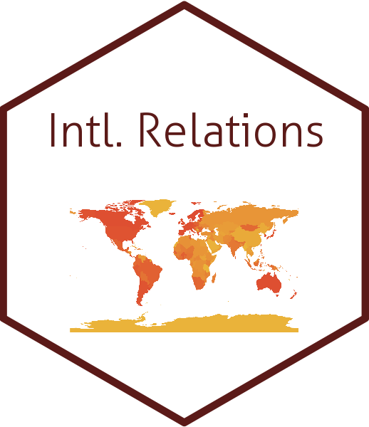

## SCEconSanction      
This is the repository for the research titled "Social Capital and the Sucess of Economic Sanction."
- This repository provides [code](https://github.com/pherephobia/SCEconSanction/blob/main/Command_Files/Econ_social_captial.R) for replication.
- The Working draft (Due to this paper is on the under-review process, it is *not available* now<!--[pdf](https://github.com/pherephobia/SCEconSanction/blob/main/Documents/HurKimParkWhangv210201.pdf)-->).
- Feel free to send me a message by [email](sp23@email.sc.edu) via [webpage](shpark.netlify.app) or [create an issue](https://github.com/pherephobia/Authoritarian.Welfare/issues) on here. 
 

## Acknowledgment
It is a preliminary draft. Please do not cite or distribute without permission of the author.
